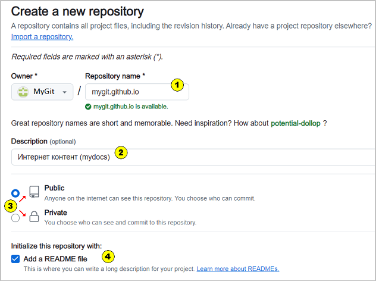
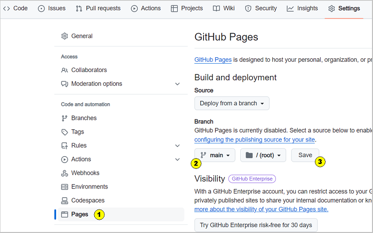

Как указывалось ранее, развертывание сайта в интернете на платформе GitHub требует создания отдельного репозитория, 
относительно которого будет развернут сайт. 

При создании репозитория могут быть два варианта:
1. Предполагается, что сайт будет только один и расположен по родительскому адресу
2. Базовый сайт уже существует, но требуется еще один сайт (дочерний сайт)

Важным для любого из вариантов является наличие репозитория с предопределенным именем: имя_аккаунта.github.io. 
Это имя фактически является частью интернет адреса, по которому будет расположен сайт или сайты.   
Для нашего примера MyGit.github.io. 

Эту схему можно представить, как список адресов сайтов:  
- `https://mygit.github.io/` - родительский сайт
- `https://mygit.github.io/site 1/` - дочерний сайт 1
- `https://mygit.github.io/site N/` - дочерний сайт N

Таким образом сайтов можно создать много.  
Каждый созданный сайт - это свой репозиторий и доступ к нему может быть отрегулирован, как Public или Private.

**Важное замечание:**
Наличие родительского сайта обязательно, но как он будет использоваться при наличии дочерних сайтов могут быть два варианта: 
- Все сайты определены одной тематикой, при этом родительский сайт может быть использован, как главная страница.
- Все сайты независимы. В этом случае родительский сайт лучше оставить пустым, добавив в репозиторий файл index.html.  
Содержание файла index.html: `<html></html>`. Можно к содержимому добавить, что-нибудь типа "страница не найдена" или 
скопировать в содержимое index.html содержимое файла 404.html (можно найти в папке build, после выполнения команды yarn build).  
  
Рис. 1 - Пример отображения на сайте "Страница не найдена"

## Создание репозитория для развертывания сайта

1.  Создаем репозиторий  
      
    Рис. 2 - Создание и настройки репозитория на GitHub

    1\. Имя репозитория (Repository name):

        - родительский сайт - mygit.github.io  
        - дочерний сайт - например, smydocs   

    2\. Описание репозитория, например: Сайт ...       
    3\. Выбираем, какой будет репозиторий:  

    - Public - доступный всем для просмотра.   
    - Private - доступный тем, кто имеет разрешения.     

    4\. Обязательно ставим галку "Add a README file" для инициализации репозитория  

      
2\. После создания репозитория надо указать, что репозиторий имеет отношение к GitHub Pages и должен размещать интернет контент. 
Для этого выбираем пункт Settings в горизонтальном меню  
      
    Рис. 3 - Меню на странице аккаунта GitHub  
    На открывшейся странице  
      
    Рис. 4 - Настройка GitHub Pages  
    1\. Выбираем пункт Pages  
    2\. Выбираем main  
    3\. Нажимаем кнопку Save (сохранить)  

## Настройка конфигурационного файла

Создав репозиторий на стороне GitHub мы обеспечили место размещение сайта, но сам установленный на ПК Docusaurus ни чего не "знает" ни о каких репозиториях. 
Поэтому, необходимо провести настройку конфигурационного файла docusaurus.config.js, который лежит в корне проекта изменением некоторых свойств.

| Свойства          | Базовый сайт                | Новый сайт                   | Примечание                                                                                 |
|-------------------|-----------------------------|------------------------------|--------------------------------------------------------------------------------------------|
| title             | 'Документация'              | 'Документация'               | Это заголовок окна браузера                                                                |
| tagline           | 'base'                      | 'mydocs'                     | любое значение                                                                             |
| baseUrl           | '/'                         | '/smydocs/'                  | всегда - для родительского сайта / - для дочернего сайта это /имя репозитория/ |
| url               | '`https://mygit.github.io`' | '`https://mygit.github.io`'  | родительский URL                                                                           |
| organizationName  | 'mygit'                     | 'mygit'                      | имя аккаунта                                                                               |
| projectName       | 'mygit.github.io'           | 'smydocs'                    | имя репозитория                                                                            |
| deploymentBranch  | 'main'                      | 'main'                       | всегда                                                                                     |

## Развертывание сайта

Для развертывания сайта на платформе GitHub необходимо выполнить ряд команд в консоли проекта:

- **yarn build** - генерация (построение) содержимого сайта. При выполнении команды будет создан каталог build, который будет содержать сайт.
- **yarn serve** - проверка, что создаваемый сайт однозначно запуститься в интернет. Выполнять все время не надо, только если возникли ошибки.
- **yarn deploy** - развертывание сайта в интернет: происходит передача содержимого папки build в репозиторий на GitHub отмеченный как Pages.
         

**См. также**  
[Справка по GitHub](https://docs.github.com/ru/pages/getting-started-with-github-pages/about-github-pages)  
[Справка по Docusaurus, docusaurus.config.js](https://docusaurus.io/docs/api/docusaurus-config)  
