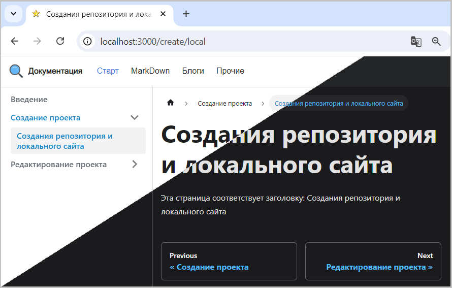

Для текущего проекта используется "зеленая" цветовая схема, которая была заимствована при создании локальной версии сайта 
[умолчанию](../../create/local.md#создание-локальной-версии-сайта). 

  
Рис. 1 - Зеленая тема

Зеленая тема подобрана и стилизована так, чтобы не допустить "новогодней елки" и режущих глаз цветов. 

Если существующая тема не нравиться, то ее можно заменить на другую, 
используя [редактор тем](https://docusaurus.io/docs/styling-layout#styling-your-site-with-infima), 
который поддерживает рекомендации [infima](https://infima.dev/docs/getting-started/introduction). 

Например, можно заменить текущую зеленую тему на синею.  
Пример реализации синей темы доступен [здесь](pathname:///files/custom_css_blue.txt).

Если заменить содержание текущего custom.css содержимым примера, то получим синею тему.  
  
Рис. 2 - Синяя тема  

