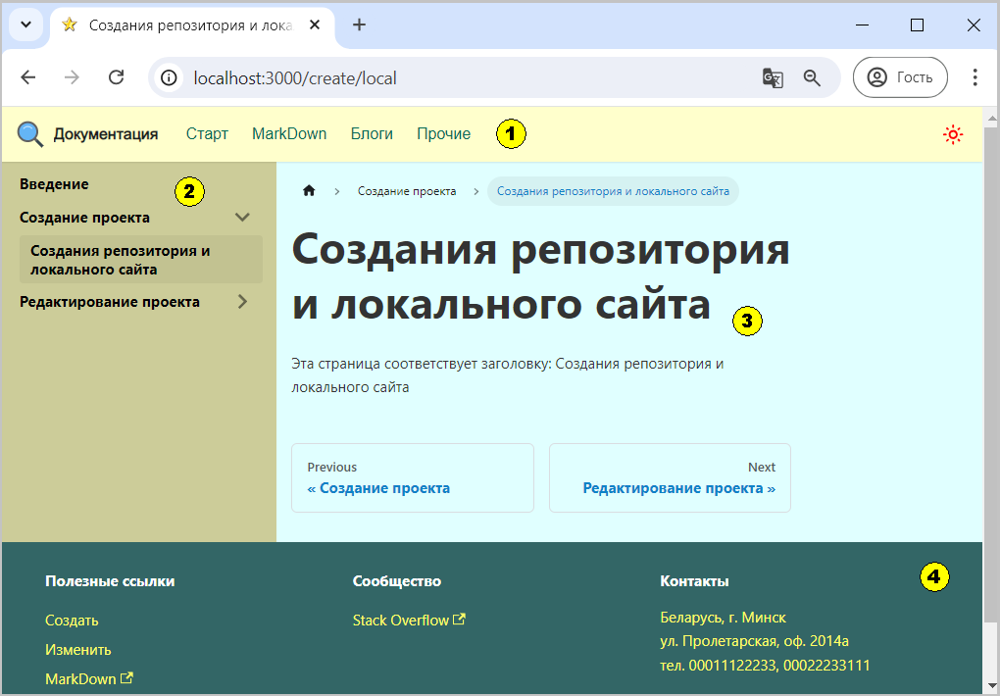

Можно вообще радикально перестроить дизайн, например так:
  
Рис. 1 - Новая версия дизайна  

На рисунке 1 видно, что изменения коснулись:
1. Цветов навигационной панели: фон и цвет элементов
2. Цветов меню в боковой панели: фон и цвет символов, жирный шрифт
3. Цветов фона текста
4. Цветов фона и текста нижнего колонтитула

Пример реализации новой темы доступен [здесь](pathname:///files/custom_css_new_design.txt).  
Если заменить текущий custom.css, то получим дизайн, как на рисунке 1.

Изменения дизайна, перечисленных выше элементов коснулось только светлой темы, что легко проверить визуально. 
В коде файла custom.css на это указывает блок `[data-theme='light']` перед изменяемым классом:
- если заменить слово "light" на "dark", то изменения станут доступны для темной темы
- если вообще убрать блок, то изменения коснуться обеих тем.  

