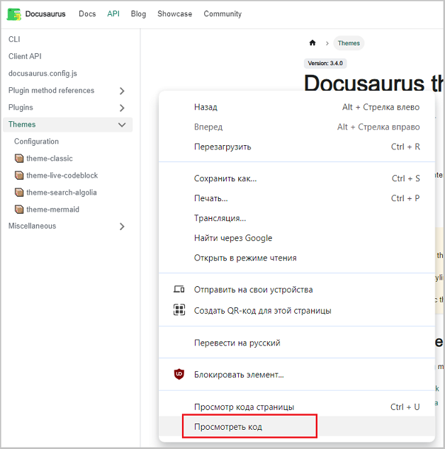
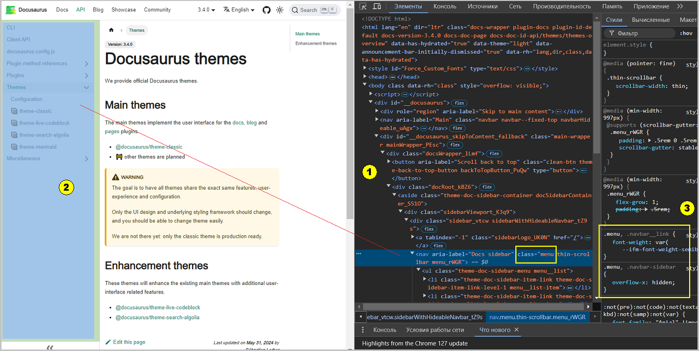

Для создания определенных визуальных эффектов (цвета, шрифты, размеры) для формируемых страниц существуют разные объекты с разными именами и 
характеристиками (цвет, шрифт и т.д.). Например, объект меню боковой панели называется `.menu` для custom.css. 
Как узнать имена классов объектов, которые хочется изменить:

- "по-гуглить"
- посмотреть в [документации](https://docusaurus.io/docs/api/themes/configuration)
- просмотреть код страницы в браузере

Для просмотра кода страницы в браузере (_на примере Chrome_) надо нажать на правую кнопку мыши. 
На экране появиться меню из которого надо выбрать пункт "Просмотреть код":
  
Рис. 1 - Меню для выбора

При этом на экране текущей страницы в браузере справа появиться форма инструментов Google Chrome.

Рис. 2 - Форма инструментов Google Chrome

Если раскрыть дерево элементов (1, меню "Элементы") и перемещаться по нему, то в той части окна, где отражается страница (2, слева), 
будут подсвечиваться голубыми прямоугольными фрагментами те области страницы (2), которые соответствуют текущей части кода элемента (1, справа). 
Находим элемент, для которого присутствует слово class, например menu. 
В крайнем справа окне (3, меню "Стили") увидим действительное наименование класса объекта, например .menu.
Далее в файле custom.css прописываем найденный класс объекта и меняем его стиль.

