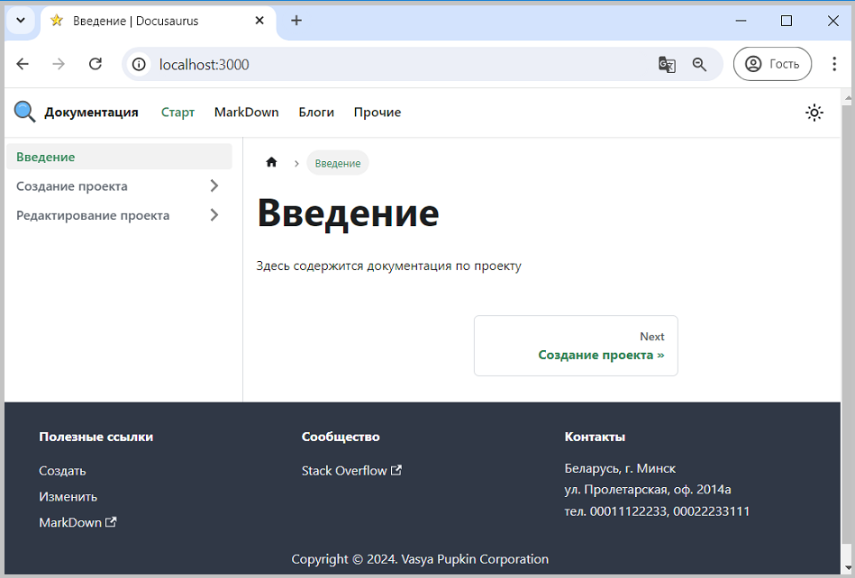

Нижний колонтитул сайта (footer) может содержать информацию, например:

- Авторские права (copyright)
- Сообщество (community)
- Адреса
- Дополнительные ссылки на другие ресурсы

Для добавления нижнего колонтитула в проект, необходимо включить в конфигурационный файл docusaurus.config.js объект footer: 
`themeConfig: ({footer: {`

Для примера создадим: 
- авторское право за "Vasya Pupkin Corporation"
- добавим 3 раздела-колонки:
1. Полезные ссылки
   - ссылка на внутреннею страницу: create
   - ссылка на внутреннею страницу: edit
   - ссылка на внешний ресурс: сайт шпаргалка по языку markdown 
2. Сообщество
   - ссылка на внешний ресурс: сайт Stack Overflow
3. Контакты
   - вымышленные контакты: html вставка

<u>**Особенности:**</u>
- для внутренних ссылок используется свойство **to**
- для внешних ссылок используется свойство **href**
- для вставки текста, картинки можно использовать свойство **html**

Пример реализации представлен [здесь](pathname:///files/docusaurus.config_footer.txt).

Если мы изменим содержание docusaurus.config.js, то получим новую функциональность.  
  
Рис. 1 - Нижний колонтитул

**См. также**  
[Документация](https://docusaurus.io/docs/api/themes/configuration#footer-1)

