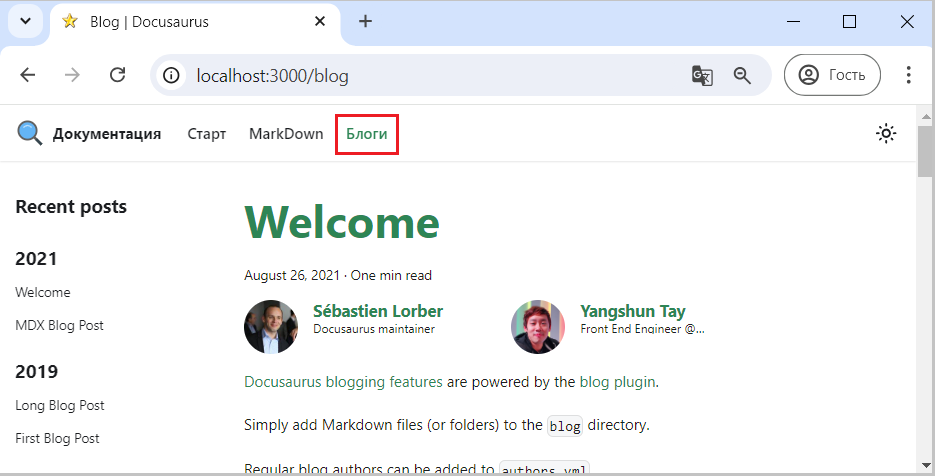

Для включения блогов на уровне проекта надо создать каталог с <u>предопределенным именем</u> **blog**.

Для примера можно просто скопировать из ранее созданного tmp сайта каталог целиком.

В массив items надо добавить объект описания блога

```js title="docusaurus.config.js"
        {
            position: 'left',
            label: 'Блоги', 
            to: '/blog', 
        },
```

Полная версия конфигурационного файла доступна [здесь](pathname:///files/docusaurus.config_navbar_menu_to_blog.txt)

Если доработки были выполнены успешно, то в навигационной панели появится кликабельный пункт "Блоги",
нажатие на который откроет страничку с блогами.


  
Рис. 1 - Страничка с блогами 

