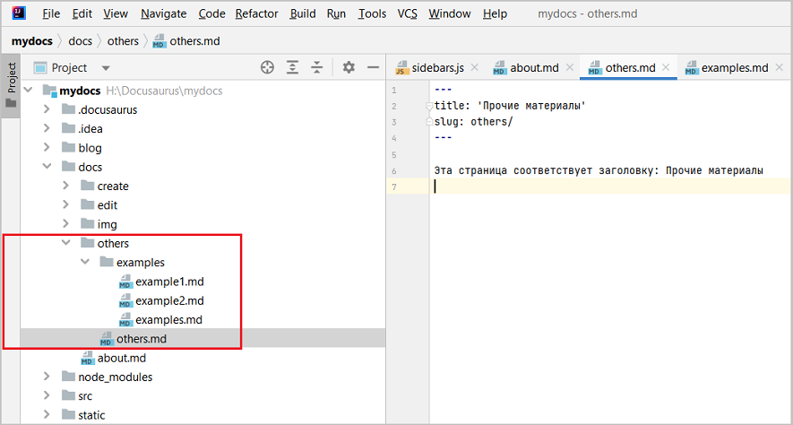
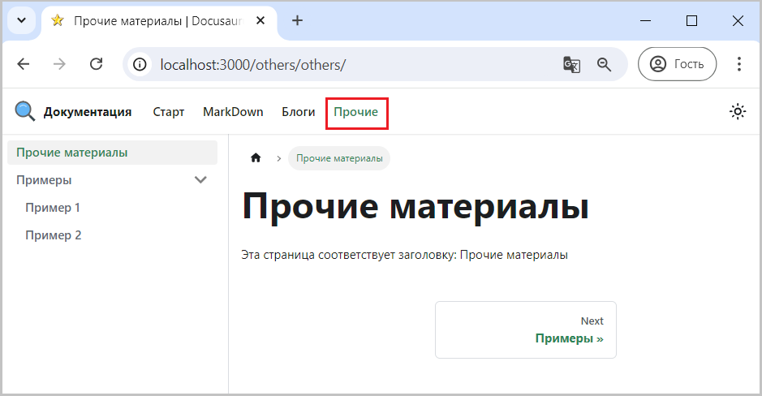

Необходимо вызвать отдельное меню, которое заместит в боковой панели существующее. 

## Создаем новое меню

Предположим это меню будет касаться каких то дополнительных материалов. 
Для этого в каталоге docs проекта:
- создадим каталог others (прочие)
- внутри каталога others создадим файл others.md с title: 'Прочие материалы'
- внутри каталога others создадим каталог examples
- внутри каталога examples создадим 3 файла: examples.md (примеры), example1.md (Пример 1), example2.md (Пример 2)

  
Рис. 1 - Структура каталогов для нового меню

В раздел заголовков файла others.md добавляем slug: others/, определяя тем самым 1-ю страницу нового меню.
```
---
title: 'Прочие материалы'
slug: others/
---

Эта страница соответствует заголовку: Прочие материалы
```


## Исправляем sidebar.js

Исправляем файл sidebar.js - в него надо добавить пункты нового меню
```
module.exports = {
    others: [
        'others/others',   // slug: others/
            {
                type: 'category',
                label: 'Примеры',
                link: {type: 'doc', id: 'others/examples/examples'}, // узел дерева - название раздела
                items: [ 'others/examples/example1','others/examples/example2', ], // пункты, входящие в раздел
            },
    ]
}
```

Полная версия sidebar.js доступна [здесь](pathname:///files/sidebar_other.txt)


## Исправляем docusaurus.config.js

Исправляем docusaurus.config.js - добавляем описание нового items
```js title="docusaurus.config.js"
        {
            type: 'doc',
            position: 'left',
            label: 'Прочие',
            docId: 'others/others',
        },      
```

Полная версия конфигурационного файла доступна [здесь](pathname:///files/docusaurus.config_navbar_menu_to_blog_menu.txt)

Если доработки были выполнены успешно, то в навигационной панели появится кликабельный пункт "Прочие",
нажатие на который откроет новое меню в боковой панели, как показано на рис. 2.

  
Рис. 2 - Новое меню "Прочие" 

<u>Примечание:</u>
- Нажатие на пункт "Документация" вернет старое меню на место
- Можно смешивать пункты из разных меню
- По аналогии можно создать несколько дополнительных меню