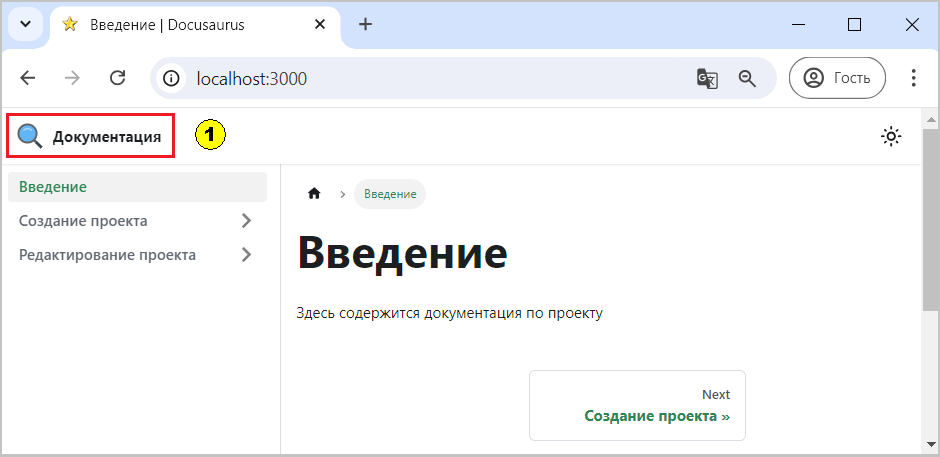

  
  
Рис. 1 - Текущее изображение сайта

Навигационная панель (1) пока представлена одним пунктом горизонтального меню "Документация", 
_который всегда ссылается на пункт "Введение" вертикального меню боковой панели_. 

Интересным представляется возможность добавить в навигационную панель:
- [вызов пункта меню боковой панели](start.md)
- [добавить интернет ссылку](to.md)
- [блог](blog.md)
- создать отдельное вертикальное меню

Все изменения в основном будут касаться файла docusaurus.config.js, в котором необходимо будет добавить массив items:
```js
  themeConfig:
    ({
      navbar: { // Панель навигации
        title: 'Документация',
        logo: {
          alt: 'Документация',
          src: 'img/logo.svg',
        },

      items: [ // добавляем новые пункты
        // здесь будем добавлять новые объекты {}
      ],
     },

```


**См. также**  
[Документация, navbar](https://docusaurus.io/docs/api/themes/configuration#navbar)

