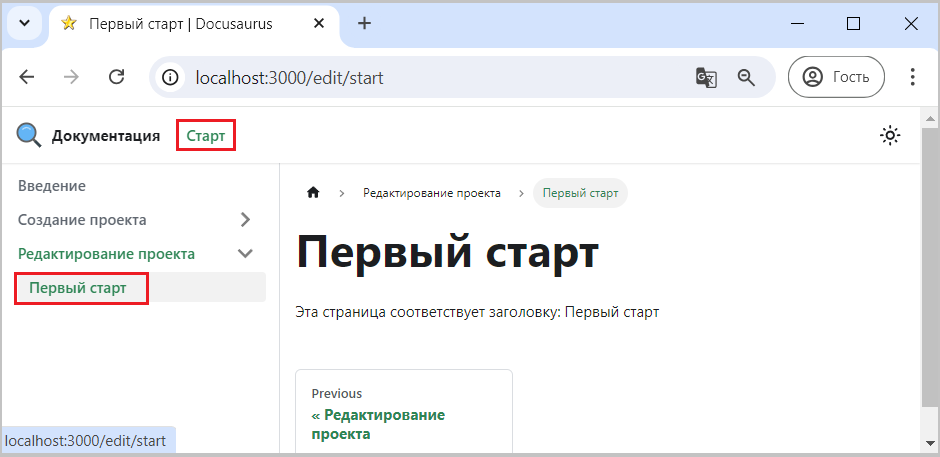

Для примера в навигационной панели добавим пункт "Старт", который будет вызывать пункт вертикального меню "Первый старт".

```js title="docusaurus.config.js" 
        { 
            type: 'doc',
            position: 'left',
            label: 'Старт',
            docId: 'edit/start',
        },
```

Полная версия конфигурационного файла доступна [здесь](pathname:///files/docusaurus.config_navbar_menu.txt)

Если доработки были выполнены успешно, то в навигационной панели появится кликабельный пункт "Старт", 
нажатие на который откроет пункт меню "Первый старт", как показано на рис. 1.

  
Рис. 1 - Выбор пункта меню 

