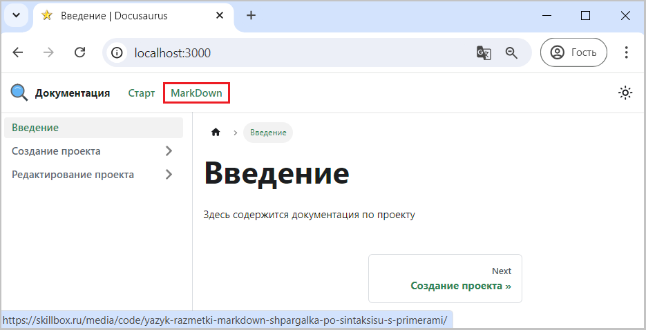

Для примера вызовем сайт с описанием языка MarkDown.

```js title="docusaurus.config.js"
        {
           label: 'MarkDown',
           to: 'https://skillbox.ru/media/code/yazyk-razmetki-markdown-shpargalka-po-sintaksisu-s-primerami/'
        },
```

Полная версия конфигурационного файла [здесь](pathname:///files/docusaurus.config_navbar_menu_to.txt)

Если доработки были выполнены успешно, то в навигационной панели появится кликабельный пункт "MarkDown",
нажатие на который откроет сайт с описанием языка MarkDown.


  
Рис. 1 - Интернет ссылка 
