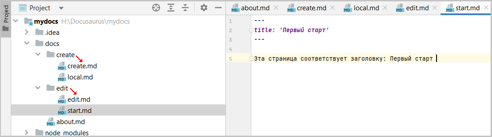
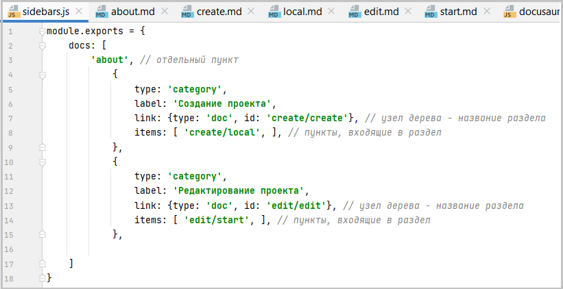
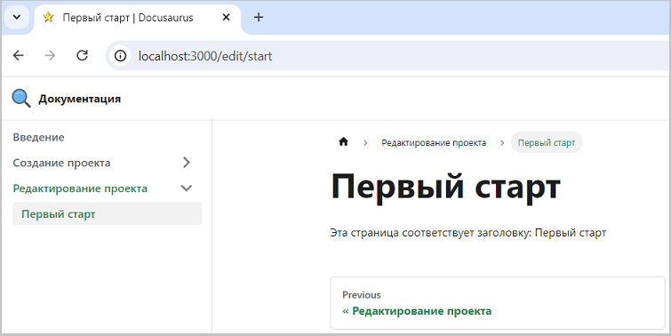

## Структура сайта

Прежде чем приступим к добавлению новых страниц определим структуру сайта, при этом могут быть разные варианты:
1. Структура может быть типа все в одном каталоге. То есть все страницы находятся в одном каталоге папки docs. Картинки находятся в каталоге img папки docs. 
В первом приближении это выглядит достаточно просто, но не эффективно. Надо будет придумывать страницам сложные имена, чтобы они не пересекались в каталоге. 
И придумывать не менее сложные имена картинкам, которые должны указывать на принадлежность к тем или иным страницам. 
2. Сразу создавать в папке docs структуру будущего сайта - где каждой теме или разделу соответствует свой каталог с папкой img, в котором лежат картинки. 
В этом случае: имена страниц будут просты, они могут даже повторяться для разных каталогов. 
Картинки, относящиеся к своим страницам можно просто именовать по имени страницы, добавляя в конце порядковый номер. 
3. Могут быть еще [варианты](https://docusaurus.io/docs/create-doc).
4. При некоторых настройках sidebars.js можно его вообще ни как не заполнять. Все будет строиться автоматически, но в этом случае, 
чтобы сохранить нужный порядок следования страниц, они должны располагаться в алфавитном порядке.

Для решения задач обучения выберем второй вариант.

## Создаем новые страницы

Ранее определились, чтобы не "ломать голову" над наполнением сайта взять за основу наполнение текущего сайта.  
По этому определим структуру сайта, представив ее в виде таблицы:

| Название страницы                        | Название файла или  каталога | Каталог       | Примечание   |
|------------------------------------------|------------------------------|---------------|--------------|
| Документация                             | about.md                     | docs          | создан ранее |
|                                          | create                       | docs          | каталог      |
| Создание проекта                         | create.md                    | docs / create |              |
| Создания репозитория и  локального сайта | local.md                     | docs / create |              |
|                                          | edit                         | docs          | каталог      |
| Редактирование проекта                   | edit.md                      | docs / edit   |              |
| Первый старт                             | start.md                     |               |              |
  
 Создадим каталоги (create, edit) и соответствующие файлы create, local. edit, start с расширением md в дереве проектов редактора IntelliJ IDEA.
 Для всех файлов свойство title - соответствует колонке "Название страницы". 
 Текст на странице начинается со слов "Эта страница соответствует заголовку:" и далее через пробел название заголовка, _ну или свой собственный текст_.
:::info так как: 
 Наполнение в контексте решаемой задачи не столь важно.  
 Рассматривается задача не создания реального сайта, а принципов его построения.
:::

 :::tip внимание
Для каталога существует одноименный файл md (отмечено красной стрелкой). Это необязательное условие - файл может быть с любым именем.
Но если связывать имя каталога с одноименным файлом, то впоследствии будет проще ориентироваться в структуре сайта.
:::
 
  
Рис. 1 - Содержание дерева проектов

## Заполняем файл sidebars.js

Заполняем файл sidebars.js, как показано на рисунке
  
Рис. 2 - Содержание файла sidebars.js

Можно выделить следующие моменты:
- объект `{type: 'category', ...}` - создаем новый раздел, название которого определяется содержанием свойства label
- массив `items[...,]` - пункты, входящие в выбранный раздел
- внутри массива `items` можно вставить новый объект `{type: 'category', ...}`   
- все обращения к страницам идут относительно своих каталогов, например create/create или create/local, где:
  + create - название каталога
  + ctreate или local - названия md файлов без указания расширения

## Старт локального сайта

Если все было выполнено правильно, то при выполнении в консоли проекта команды **yarn start** произойдет старт локального сайта.  
  
Рис. 2 - Вид сайта

- слева имеем древовидное меню
- справа, отображение страниц, связанных с меню

