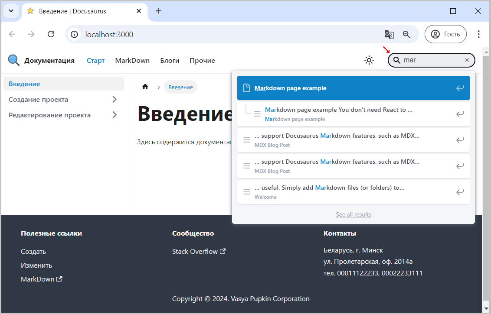

Плагин находится на GitHub по адресу https://github.com/easyops-cn/docusaurus-search-local.
Для настройки и подключения файла надо открыть для чтения файл readme.md, в котором содержится инструкция для установки и подключения в проекте.

Если установка прошла успешно, то надо добавить изменения в файл docusaurus.config.js

```js title="docusaurus.config.js"
      themes: [
        // ... Настройки вашей темы
        [
          require.resolve("@easyops-cn/docusaurus-search-local"),
          /** @type {import("@easyops-cn/docusaurus-search-local").PluginOptions} */
          ({
            // ... Ваши опции
            // рекомендуется использовать `hashed`, поскольку возможно долгосрочное кэширование индексного файла
            hashed: true,
            language: ["en", "ru"], // включаем обрабатываемые языки
            indexBlog: true, // включаем индексирование для поиска блога (если он есть или мы этого хотим), иначе false 
            indexPages: true, // индексируем страницы для поиска
          }),
        ],
      ],
```

> Приводится минимальный набор свойств, который обеспечивает работу поисковой системы.  
> Более подробно смотри в описании файла readme.md

Пример реализации docusaurus.config.js представлен [здесь](pathname:///files/docusaurus.config_seach_easyops-cn.txt).

Если все было выполнено правильно, то справа вверху появиться поле для поиска.  
  
Рис. 1 - Сайт с окном результатов поиска  

 


