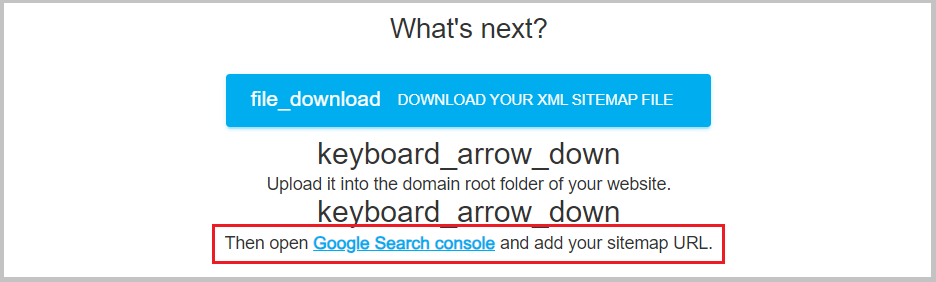

XML-Sitemap (карта сайта) — файл для ботов поисковых систем с перечнем всех страниц сайта в формате XML. 
Он нужен, чтобы поисковые системы более эффективно сканировали и индексировали содержимое сайта.

Как создать карту сайта, можно прочитать [здесь](https://netpeak.net/ru/blog/sitemap-xml-ili-karta-saita-detal-nyi-manual/).

Для текущего сайта при создании карты сайта использовался инструмент https://www.xml-sitemaps.com/. 
После создания sitemap.xml, файл был добавлен в корень проекта. 

Кроме создания карты сайта можно воспользоваться инструментом [Google Search Console](https://search.google.com/search-console), 
который представляет информацию о том, как ваш сайт представлен в результатах поиска Google, оптимизировать контент и устранять возможные неполадки. 
Сервис бесплатный, регистрация необязательна.

После создания карты вашего сайта с использованием инструмента `www.xml-sitemaps.com`,  
последний будет содержать кликабельную ссылку на Google Search Console.  

  
Рис. 1 - Кликабельная ссылка сайта для перехода на Google Search Console 
