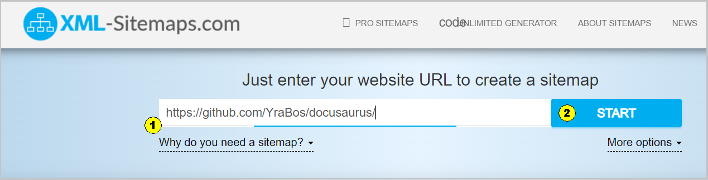
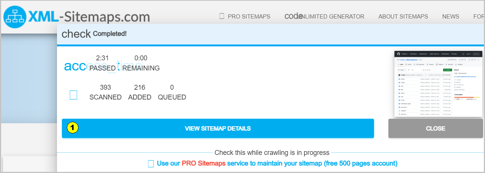

XML-Sitemap (карта сайта) — файл для ботов поисковых систем с перечнем всех страниц сайта в формате XML. 
Он нужен, чтобы поисковые системы могли более эффективно сканировать и индексировать содержимое сайта.

Для текущего сайта при создании карты сайта использовался инструмент https://www.xml-sitemaps.com/. 
После создания sitemap.xml, файл был добавлен в корень проекта. 

<u>Примечание:</u>  
- все приводимые изображения по созданию sitemap.xml относительно сайта https://yrabos.github.io/docusaurus/
- бесплатная версия сайта xml-sitemaps.com имеет ограничение на количество обрабатываемых страниц: 500 ед.

Открываем сайт и вносим URL сайта (1) и нажимаем кнопку "START" (2):  
  
Рис. 1 - Создание карты сайта, начало

Процесс занимает какое-то время (несколько минут или более). 
На экране в процессе работы будут отображаться обрабатываемые ресурсы сайта. 
По окончания процесса появиться новое окно, в котором надо нажать кнопку "VIEW SITEMAP DETAILS" (1) (просмотр карты сайта)
  
Рис. 2 - Создание карты сайта, продолжение

После нажатия на кнопку "VIEW SITEMAP DETAILS" появиться новое окно с информацией о созданной карте сайта.
  
Рис. 3 - Создание карты сайта, завершение   
Нажимаем на кнопку "file_download DOWNLOAD VIEW XML SITEMAP FILE" (1), чтобы загрузить в папку Downloads на ПК сформированный файл sitemap.xml. 
Внизу экрана присутствует кнопка "CREATE FREE PRO SITEMAPS ACCOUNT" (2) для регистрации и создания аккаунта, но эта операция необязательная.
После приема файла sitemap.xml он добавляется в корень проекта (_туда же, где лежит docusaurus.config.js_) 

Кроме создания карты сайта можно воспользоваться инструментом [Google Search Console](https://search.google.com/search-console), 
который представляет информацию о том, как сайт будет представлен в результатах поиска Google, оптимизировать контент и устранять возможные неполадки. 
Сервис бесплатный, регистрация необязательна.

**См. также**  
[Карты сайта](https://netpeak.net/ru/blog/sitemap-xml-ili-karta-saita-detal-nyi-manual/)
